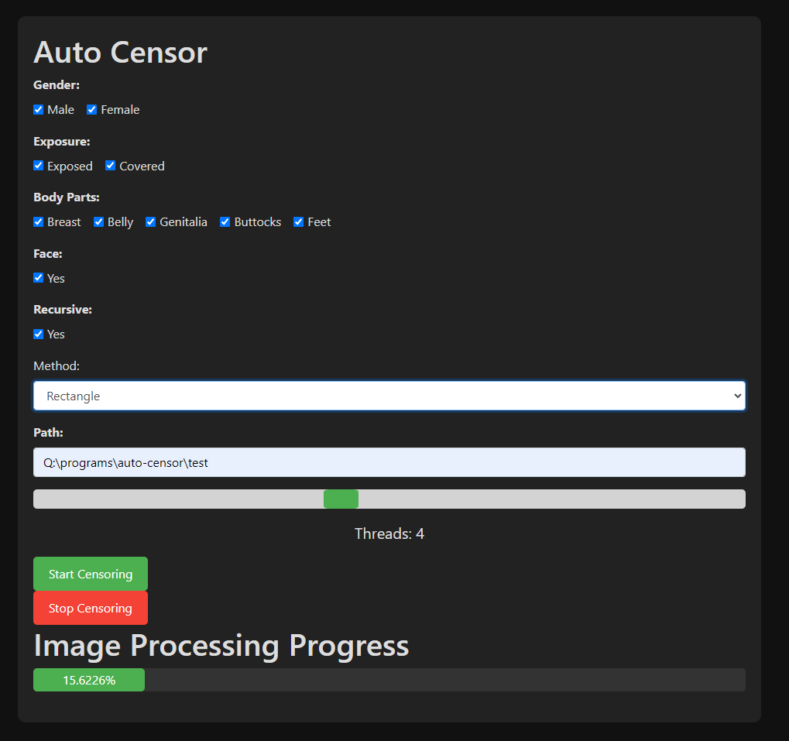

# Auto Censor
Auto Censor is a simple solution to censor your porn collection. Auto Censor spins up a webserver and provides you with a simple interface for the censor configuration.
You can than start the censor process, see it's progress and also stop it.
⚠️⚠️⚠️Because Auto Censor isn't just some kinky fun software, there are no backups of your media. Auto Censor will overwrite your images based on your configurations. ⚠️⚠️⚠️

## Usage
### .EXE
1. Download the .exe file from  the [latest release](https://github.com/vanishedbydefa/auto-censor/releases)
2. Run it by double clicking the icon.
3. INFO: Windows Defender may pop up a [blue screen](https://raw.githubusercontent.com/vanishedbydefa/auto-censor/main/images/windows_defender_message.jpeg) because the exe has an "unknown vendor".
   * This is perfectly fine and nothing to worry about. Resolve the problem by clicking "More Information" and than click "Run anyway".
     * If you don't trust me you can verify there is nothing bad in the exe by:
     1. Check the code for anything malicious.
     2. Compile the code to an exe, using the commands from [dev notes](https://github.com/vanishedbydefa/auto-censor/blob/main/dev_notes.md).
     3. Compare the SHA512 sum of the resulting exe with the hash from the latest release.

### CLI
1. Clone the repository by either using `git clone https://github.com/vanishedbydefa/auto-censor.git` or clicking on the green Button "Code" -> "Download ZIP"
2. Extract the ZIP if necessary.
3. Open a command prompt and move into the extracted directory. (eg. `cd Q:\programs\auto-censor-main`)
4. Install the necessary requirements by running `pip install -r requirements.txt`
5. Start Auto-Censor with `python webserver.py`

## Restrictions
Auto Censor relies on [NudeNet](https://github.com/notAI-tech/NudeNet) and can only censor whats found by NudeNet.
Because NudeNet isn't compatible with all filenames, it can happen that there are files that can't be censored as NudeNet can't detect any nudity.
